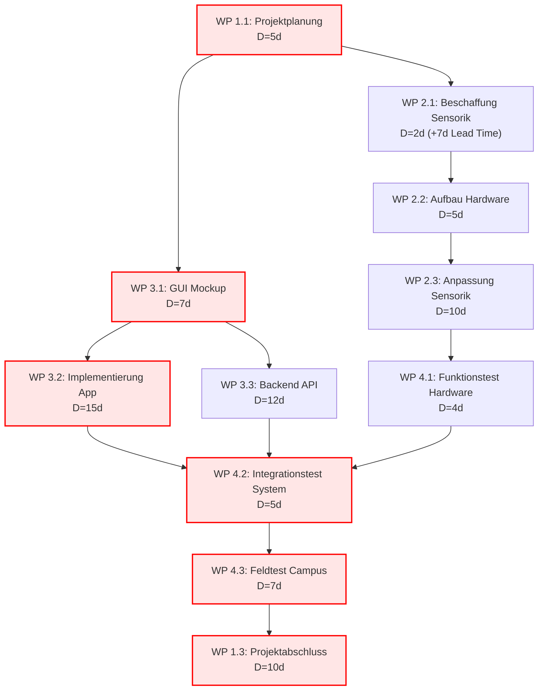

# Smart Waste - Network Diagram (Netzplan)

```mermaid
graph TD
    classDef critical fill:#ffe6e6,stroke:#ff0000,stroke-width:2px;

    WP_11["WP 1.1: Projektplanung<br/>D=5d"]
    WP_21["WP 2.1: Beschaffung Sensorik<br/>D=2d (+7d Lead Time)"]
    WP_22["WP 2.2: Aufbau Hardware<br/>D=5d"]
    WP_23["WP 2.3: Anpassung Sensorik<br/>D=10d"]
    WP_31["WP 3.1: GUI Mockup<br/>D=7d"]
    WP_32["WP 3.2: Implementierung App<br/>D=15d"]
    WP_33["WP 3.3: Backend API<br/>D=12d"]
    WP_41["WP 4.1: Funktionstest Hardware<br/>D=4d"]
    WP_42["WP 4.2: Integrationstest System<br/>D=5d"]
    WP_43["WP 4.3: Feldtest Campus<br/>D=7d"]
    WP_13["WP 1.3: Projektabschluss<br/>D=10d"]

    %% Verknüpfungen
    WP_11 --> WP_21
    WP_21 --> WP_22
    WP_22 --> WP_23
    WP_11 --> WP_31
    WP_31 --> WP_32
    WP_31 --> WP_33
    WP_23 --> WP_41
    WP_32 --> WP_42
    WP_33 --> WP_42
    WP_41 --> WP_42
    WP_42 --> WP_43
    WP_43 --> WP_13

    %% Kritischer Pfad (Rot hervorgehoben)
    class WP_11,WP_31,WP_32,WP_42,WP_43,WP_13 critical;
```
