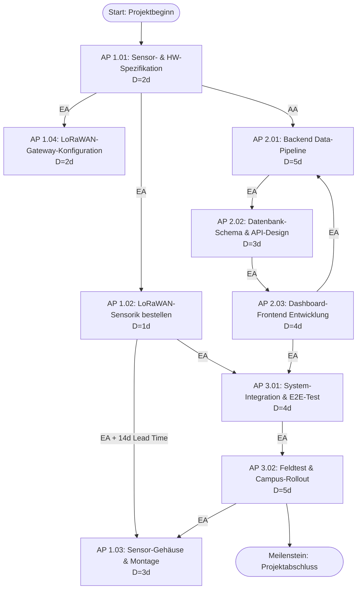

# Sample Schedule (Fehlerhafter Prüfplan)

```mermaid
graph TD
    M_Start([Start: Projektbeginn]) --> AP_101[AP 1.01: Sensor- & HW-Spezifikation<br/>D=2d]
    
    %% Hardware-Strang
    AP_101 --> | EA | AP_102[AP 1.02: LoRaWAN-Sensorik bestellen<br/>D=1d]
    AP_102 --> | EA + 14d Lead Time | AP_103[AP 1.03: Sensor-Gehäuse & Montage<br/>D=3d]
    
    %% Gateway / Infrastruktur
    AP_101 --> | EA | AP_104[AP 1.04: LoRaWAN-Gateway-Konfiguration<br/>D=2d]
    
    %% Software-Strang
    AP_101 --> | AA | AP_201[AP 2.01: Backend Data-Pipeline<br/>D=5d]
    AP_201 --> | EA | AP_202[AP 2.02: Datenbank-Schema & API-Design<br/>D=3d]
    AP_202 --> | EA | AP_203[AP 2.03: Dashboard-Frontend Entwicklung<br/>D=4d]
    AP_203 --> | EA | AP_201
    
    %% Integration & Test
    AP_102 --> | EA | AP_301[AP 3.01: System-Integration & E2E-Test<br/>D=4d]
    AP_203 --> | EA | AP_301
    AP_301 --> | EA | AP_302[AP 3.02: Feldtest & Campus-Rollout<br/>D=5d]
    AP_302 --> | EA | AP_103
    AP_302 --> M_End([Meilenstein: Projektabschluss])
```
    