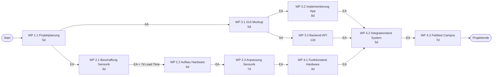

```mermaid
graph LR

Start([Start])

WP11[WP 1.1 Projektplanung<br/>5d]
WP21[WP 2.1 Beschaffung Sensorik<br/>3d]
WP22[WP 2.2 Aufbau Hardware<br/>6d]
WP23[WP 2.3 Anpassung Sensorik<br/>7d]

WP31[WP 3.1 GUI Mockup<br/>5d]
WP32[WP 3.2 Implementierung App<br/>8d]
WP33[WP 3.3 Backend API<br/>12d]

WP41[WP 4.1 Funktionstest Hardware<br/>4d]
WP42[WP 4.2 Integrationstest System<br/>5d]
WP43[WP 4.3 Feldtest Campus<br/>7d]

Ende([Projektende])

Start --> WP11

WP11 -->|EA| WP21
WP21 -->|EA + 7d Lead Time| WP22
WP22 -->|EA| WP23

WP11 -->|AA| WP31
WP31 -->|EA| WP32
WP31 -->|AA| WP33

WP23 -->|EA| WP41

WP32 -->|EA| WP42
WP33 -->|EA| WP42
WP41 -->|EA| WP42

WP42 -->|EA| WP43

WP43 --> Ende
```
